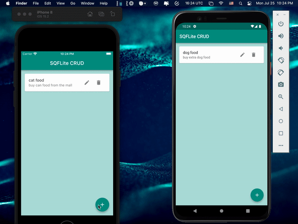

&nbsp;&nbsp;
&nbsp;&nbsp;
<a href="https://choosealicense.com/licenses/mit/" target="_blank"></a>&nbsp;&nbsp;
&nbsp;&nbsp;
&nbsp;&nbsp;

# SQFLite CRUD - [KindaCode](https://www.kindacode.com/article/flutter-sqlite/)

</img>
Introduction to SQFLite: This repo will teach you how to use [sqflite](https://pub.dev/packages/sqflite) package for storing data locally in your device. In addition to that, there is another package called [path_provider](https://pub.dev/packages/path_provider), which is necessary for providing the storage directory or location to the sqflite package.<br>

SQFLite only supports the following platforms:

```
    1. ANDROID
    2. IOS
    3. MACOS
```

## Packages Used

```yaml
# Database storage
sqflite: ^2.0.3
# Provide database file location for iOS, Android & macOS
path_provider: ^2.0.11
```

## App Demo

<p align="center"></p>

## SQFLite CRUD

Create: [db_helper.dart](lib/db/db_helper.dart)

```dart
// Create new item (journal)
  static Future<int> createItem(String title, String? description) async {
    final db = await SQLHelper.db();

    final data = {'title': title, 'description': description};
    final id = await db.insert('items', data,
        conflictAlgorithm: sql.ConflictAlgorithm.replace);
    return id;
  }
```

Read: [db_helper.dart](lib/db/db_helper.dart)

```dart
  // Read all items (journals)
  static Future<List<Map<String, dynamic>>> getItems() async {
    final db = await SQLHelper.db();
    return db.query('items', orderBy: "id");
  }

  // Read a single item by id
  // The app doesn't use this method but I put here in case you want to see it
  static Future<List<Map<String, dynamic>>> getItem(int id) async {
    final db = await SQLHelper.db();
    return db.query('items', where: "id = ?", whereArgs: [id], limit: 1);
  }
```

Update: [db_helper.dart](lib/db/db_helper.dart)

```dart
  // Update an item by id
  static Future<int> updateItem(
      int id, String title, String? description) async {
    final db = await SQLHelper.db();

    final data = {
      'title': title,
      'description': description,
      'createdAt': DateTime.now().toString()
    };

    final result =
        await db.update('items', data, where: "id = ?", whereArgs: [id]);
    return result;
  }
```

Delete: [db_helper.dart](lib/db/db_helper.dart)

```dart
  // Delete
  static Future<void> deleteItem(int id) async {
    final db = await SQLHelper.db();
    try {
      await db.delete("items", where: "id = ?", whereArgs: [id]);
    } catch (err) {
      debugPrint("Something went wrong when deleting an item: $err");
    }
  }
```

## File Pattern Inside The `lib` Folder

```
lib/
├── db/
│   └── db_helper.dart
├── views/
│   └── home_page.dart
└── main.dart
```
